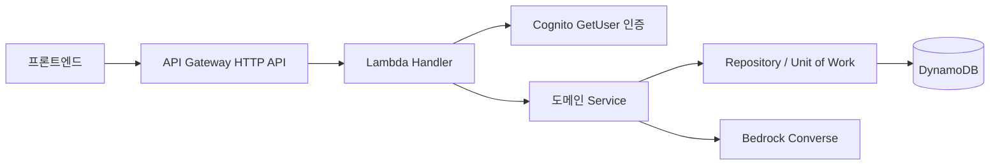

# DB 구성 및 AWS 배포

## 구성



[infra/template.yaml](../infra/template.yaml)은 DynamoDB, Cognito User Pool/Client, API Gateway, Lambda, 로그 보존 설정을 생성합니다. AWS 계정 리소스를 실제로 생성한 상태는 아닙니다. 기존 DB는 필요 없으며 배포 시 테이블이 자동 생성됩니다. 리전은 서울(ap-northeast-2)을 사용하세요.

## DynamoDB 데이터 모델

단일 테이블, 문자열 파티션 키 `pk`입니다. 모든 항목은 `{pk, version, data}` 형식입니다.

| 키 | 저장 내용 | 조회 |
|---|---|---|
| user#{userId} | 이름·이메일·역할·생성일·groupIds | GetItem |
| group#{groupId} | 고령자, 구성원, 기록, 일정, 교대 이력, 인수인계, 승인 | GetItem |
| invite#{SHA256(token)} | 그룹·대상 이메일·역할·만료 | GetItem |
| email#{email} | 로컬 인증 이메일 인덱스 | 로컬만 |
| session#{SHA256(token)} | 로컬 세션·만료 | 로컬만 |
| login#{SHA256(email)} | 로컬 로그인 실패 횟수 | 로컬만 |

운영 인증은 Cognito이므로 비밀번호·세션을 DynamoDB에 저장하지 않습니다. 내 그룹 조회는 user.groupIds를 이용하며 전체 테이블 Scan을 하지 않습니다. 그룹 참가/탈퇴는 사용자 groupIds와 그룹 구성원을 하나의 TransactWrite로 변경합니다. 조회한 모든 레코드의 version 조건을 확인해 동시 교대·삭제·승인 경쟁에서 덮어쓰기를 막습니다. 충돌은 409로 반환하며 외부 AI 호출을 자동 반복하지 않습니다.

소규모 MVP에서는 그룹 전체를 하나의 레코드로 저장합니다. 앱이 350 KB를 넘는 레코드를 거절해 DynamoDB 항목 제한 이전에 명확한 413 오류를 반환합니다. 장기 기록 운영 전에는 CareEvent/CareHandoff를 별도 항목으로 분리하고 날짜 Query 및 커서 페이지네이션을 추가해야 합니다. 데이터는 자동 삭제하거나 잘라내지 않습니다.

암호화, 시점 복구(PITR), 온디맨드 과금이 설정됩니다. 스택 삭제 시 DB와 User Pool을 보존합니다. DB 자체 저장 실패는 기존 상태를 유지합니다. TTL 항목을 사용하더라도 앱에서 만료를 즉시 검증합니다.

## 배포

AWS CLI/SAM CLI, Node.js 22, npm을 설치하고 본인 AWS 계정으로 CLI 로그인한 후:

```powershell
pnpm install --frozen-lockfile
pnpm test
sam validate --lint --template-file infra/template.yaml
sam build --template-file infra/template.yaml
sam deploy --guided --region ap-northeast-2
```

배포 과정에서 `FrontendOrigin`을 실제 프론트 주소로 설정하세요. 스택 출력은 API URL, 테이블명, User Pool ID, Client ID입니다. 리소스 생성에는 AWS 사용 비용이 발생하며 이 저장소 작업에서는 실제 배포를 실행하지 않았습니다.

`BedrockModelId`를 비워두면 원문 추출 모드로 실행됩니다. 실제 생성형 AI를 켜려면 서울 리전에서 계정이 사용할 수 있는 Converse 지원 모델 ID와 동일 모델의 `BedrockModelArn`을 전달해야 합니다. 모델 ID를 임의로 고정하지 않았습니다. 교차 리전 추론 프로필은 추가 IAM 구성이 필요하며 현재 템플릿은 리전 내 모델 ARN을 전제로 합니다.

로컬에서 Bedrock을 시험할 때는 AWS CLI의 인증 정보를 사용합니다. 비밀 키를 소스나 .env.example에 저장하지 마세요.

```powershell
$env:AWS_REGION = 'ap-northeast-2'
$env:AI_PROVIDER = 'bedrock'
$env:BEDROCK_MODEL_ID = '<계정에서 사용할 수 있는 모델 ID>'
pnpm start
```

## 인증 흐름

가입 → 이메일 코드 → `/auth/confirm` → 로그인 → Bearer 토큰 API 호출입니다. Lambda가 Cognito GetUser API로 토큰을 검증하므로 API Gateway에서 임의 userId나 디코딩만 한 JWT를 신뢰하지 않습니다. 로그아웃은 Cognito GlobalSignOut으로 전체 세션을 폐기합니다. 가입/로그인은 공개 경로이므로 Gateway 기본 요청 제한과 Cognito의 요청 제한이 적용됩니다.

초대 토큰은 API 응답으로만 반환하며 사용자가 직접 전달합니다. 이메일 인증된 계정만 AWS 그룹에 참여할 수 있습니다. 개발용 로컬 가입에서는 실제 이메일 소유 검증을 생략합니다.

## AI 결과 검증과 실패

Bedrock에는 고령자 이름/이메일을 제외한 해당 그룹의 선택 기간 기록과 예정 일정만 보냅니다. 기록 본문은 명령이 아닌 데이터로 취급하며 진단·복약 변경을 금지하는 시스템 지시를 사용합니다. 출력 JSON, 필수 분류 필드, 근거 ID, 정확한 원문 인용을 검증합니다. 이것만으로 의미적 오류를 완전히 배제할 수는 없으므로 실제 모델 평가가 필요합니다. 원문 확인이 가능하도록 근거를 함께 반환합니다.

Bedrock 장애를 성공 요약으로 숨기지 않습니다. 502 오류와 재시도 안내를 반환합니다. 로컬 대체 모드는 명시적으로 선택한 별도 모드입니다.

참고: [AWS Converse SDK 예제](https://docs.aws.amazon.com/us_en/code-library/latest/ug/javascript_3_bedrock-runtime_code_examples.html), [DynamoDB 트랜잭션](https://docs.aws.amazon.com/amazondynamodb/latest/developerguide/transactions.html).
