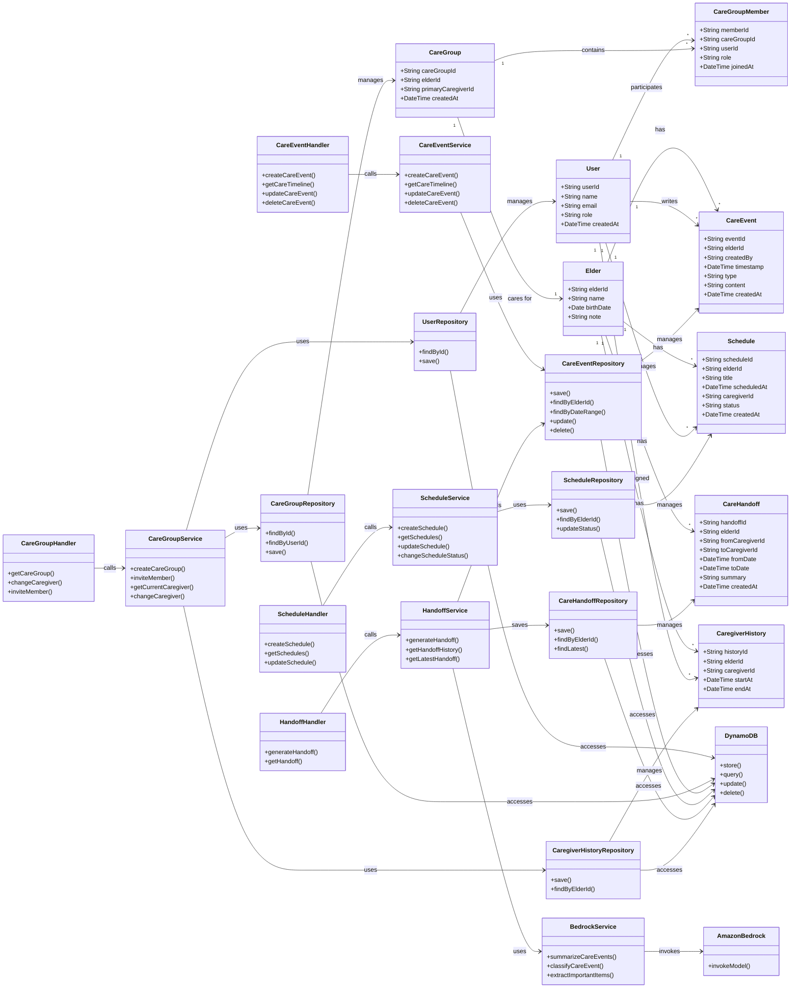

# FCC.md

---

## Family Care Cloud (FCC)

# **Revision history**

---

| **Revision date** | **Version #** | **Description** | **Author** |
| --- | --- | --- | --- |
| 09/10/2026 | 1.00 | 초안 | 한준영 |
|  |  |  |  |
|  |  |  |  |
|  |  |  |  |

# 1. Introduction

---

# 2. Use Case Analysis

## 2.1 주요 사용자(Actor)

---

### 가족 보호자

Family Care Cloud의 핵심 사용자로, 고령자의 돌봄 기록 작성, 일정 관리, 담당 보호자 교대 및 AI Care Handoff 확인 등의 기능을 이용한다.

### 고령자 *(확장 기능)*

향후 AI 음성 도우미 기능을 통해 자신의 병원 일정, 가족 방문 일정, 담당 보호자 등의 정보를 자연어 또는 음성으로 확인할 수 있다.

> **MVP의 Primary Actor는 가족 보호자로 설정한다.**
>

AI 시스템은 사용자가 직접 상호작용하는 Actor가 아니라 서비스 내부에서 돌봄 기록을 분석하고 인수인계를 생성하는 시스템 구성 요소로 정의한다.

## 2.2 서비스 핵심 흐름

---

Family Care Cloud의 핵심 서비스 흐름은 다음과 같다.

> **가족 보호자 가입 → Care Group 생성 → 고령자 등록 → 돌봄 기록 작성 → Care Timeline 축적 → 일정 관리 → 담당 보호자 교대 → AI Care Handoff 생성 → 다음 보호자 확인**
>

서비스의 핵심은 여러 가족 구성원이 번갈아 고령자를 돌보는 상황에서 발생하는 **돌봄 정보의 단절을 최소화하는 것**이다.

## 2.3 주요 기능

---

### 회원 및 Care Group 관리

1. 회원가입
2. 로그인
3. 로그아웃
4. 내 프로필 조회 및 수정
5. Care Group 생성
6. Care Group 가족 초대 및 참여
7. 가족 구성원 조회
8. Care Group 탈퇴

> 비밀번호 찾기, 계정 탈퇴 등 일반적인 인증 기능은 실제 개발 방식에 따라 추가한다.
>

### 고령자 관리

1. 고령자 등록
2. 고령자 기본정보 조회
3. 고령자 정보 수정
4. Care Group과 고령자 연결
5. 현재 담당 보호자 지정
6. 다음 담당 보호자 지정
7. 담당 보호자 변경
8. 현재 돌봄 담당자 조회

### 돌봄 기록 및 Care Timeline 관리

1. 돌봄 기록 작성
2. 돌봄 기록 조회
3. 돌봄 기록 수정
4. 돌봄 기록 삭제
5. 돌봄 기록 유형 지정
    - 병원
    - 복약
    - 식사
    - 생활
    - 일정
    - 특이사항
6. 기록 작성자 확인
7. 최근 돌봄 기록 조회
8. 날짜 및 유형별 기록 조회
9. Care Timeline 조회

### 일정 관리

1. 병원 일정 등록
2. 검사 일정 등록
3. 가족 방문 일정 등록
4. 기타 돌봄 일정 등록
5. 일정 조회
6. 일정 수정
7. 일정 삭제
8. 일정 상태 변경
    - 예정
    - 완료
    - 취소
9. 일정별 담당 보호자 지정
10. 오늘 및 다음 일정 조회

### AI Care Handoff

최근 Care Timeline에 누적된 돌봄 기록을 AI가 분석하여 다음 보호자가 알아야 할 핵심 내용을 자동으로 정리한다.

1. AI Care Handoff 생성
2. 최근 돌봄 기록 자동 조회
3. 건강·생활 관련 주요 기록 요약
4. 예정 일정 요약
5. 다음 보호자가 확인해야 할 사항 추출
6. Care Handoff 결과 조회
7. 이전 Care Handoff 이력 조회
8. Care Handoff 재생성

예시:

> 최근 내과 방문 완료
>
>
> 약 변경 없음
>
> 식사량 감소 기록 2회
>
> 다음 진료 시 혈액검사 예정
>
> **확인 필요: 다음 보호자는 식사 상태를 지속 확인**
>

### AI 돌봄 기록 분석

보호자가 자유롭게 입력한 돌봄 기록을 AI가 분석하여 구조화된 돌봄 정보로 변환한다.

1. 자연어 돌봄 기록 입력
2. 돌봄 기록 유형 자동 분류
3. 중요 정보 추출
4. 병원·복약·식사·생활 정보 구조화
5. 주요 확인사항 추출
6. 분석 결과 저장

예시:

> "오늘 엄마 내과 다녀왔고 약은 그대로래. 다음에는 피검사 한대."
>

AI 분석 결과:

- 유형: 병원
- 병원 방문: 완료
- 약 변경: 없음
- 확인사항: 다음 진료 시 혈액검사

### 보호자 교대 관리

1. 현재 담당 보호자 조회
2. 다음 담당 보호자 지정
3. 담당 보호자 변경
4. 보호자 교대 이력 저장
5. 교대 시 AI Care Handoff 생성
6. 다음 보호자의 인수인계 확인

이 기능은 Family Care Cloud의 핵심 기능으로, **Care Timeline과 AI Care Handoff를 연결하는 역할**을 한다.

# 2.4 Detailed Use Case

---

## Use Case #1 : AI Care Handoff 생성

### GENERAL CHARACTERISTICS

- **Summary**
보호자 교대 시 최근 돌봄 기록을 AI가 분석하여 다음 보호자에게 필요한 핵심 인수인계 내용을 생성한다.
- **Scope**
Family Care Cloud
- **Level**
User Level
- **Primary Actor**
가족 보호자
- **Preconditions**
    1. 사용자는 로그인된 상태여야 한다.
    2. 해당 고령자의 Care Group에 참여하고 있어야 한다.
    3. Care Timeline에 1건 이상의 돌봄 기록이 존재해야 한다.
- **Trigger**
사용자가 `AI 인수인계 생성` 버튼을 클릭한다.
- **Success Post Condition**
    1. 최근 돌봄 기록이 정상적으로 조회된다.
    2. AI가 건강, 생활, 일정, 확인사항을 요약한다.
    3. 생성된 Care Handoff가 화면에 표시된다.
- **Failed Post Condition**
    1. 조회할 기록이 없으면 인수인계를 생성하지 않는다.
    2. AI 처리 실패 시 기존 돌봄 기록은 유지한다.
    3. 사용자에게 오류 메시지를 제공한다.

### MAIN SUCCESS SCENARIO

| Step | Action |
| --- | --- |
| S | 보호자가 Care Handoff 화면에 접근한다. |
| 1 | 사용자는 인수인계에 포함할 기간을 선택한다. |
| 2 | 사용자는 `AI 인수인계 생성` 버튼을 클릭한다. |
| 3 | 시스템은 해당 기간의 Care Timeline을 조회한다. |
| 4 | 시스템은 조회된 돌봄 기록을 AI 분석 기능에 전달한다. |
| 5 | AI는 건강·생활 변화, 주요 일정, 확인사항을 요약한다. |
| 6 | 시스템은 생성된 Care Handoff를 화면에 표시한다. |
| 7 | 사용자는 인수인계 내용을 확인한다. |

### EXTENSION SCENARIOS

| Step | Branching Action |
| --- | --- |
| 3a | 해당 기간에 기록이 없으면 `요약할 돌봄 기록이 없습니다.`라고 안내한다. |
| 4a | AI 처리에 실패하면 `인수인계 생성에 실패했습니다. 다시 시도해 주세요.`라고 안내한다. |
| 6a | 사용자는 필요할 경우 Care Handoff를 다시 생성할 수 있다. |

# Use Case #2 : 돌봄 기록 작성

---

### GENERAL CHARACTERISTICS

- **Summary**
보호자가 병원 방문, 복약, 식사, 생활 변화, 특이사항 등의 돌봄 내용을 기록하고 저장한다.
- **Scope**
Family Care Cloud
- **Level**
User Level
- **Primary Actor**
가족 보호자
- **Preconditions**
    1. 사용자는 로그인된 상태여야 한다.
    2. 해당 고령자의 Care Group에 참여하고 있어야 한다.
- **Trigger**
사용자가 `돌봄 기록 작성` 버튼을 클릭한다.
- **Success Post Condition**
    1. 작성된 돌봄 기록이 DB에 저장된다.
    2. Care Timeline에 새로운 기록이 표시된다.
    3. 작성자와 작성 시간이 함께 저장된다.
- **Failed Post Condition**
    1. 필수 내용이 누락되면 저장되지 않는다.
    2. 서버 오류 발생 시 기록 저장이 완료되지 않는다.

### MAIN SUCCESS SCENARIO

| Step | Action |
| --- | --- |
| S | 보호자가 고령자 대시보드에 접근한다. |
| 1 | 사용자는 `돌봄 기록 작성` 버튼을 클릭한다. |
| 2 | 사용자는 돌봄 내용을 자연어로 입력한다. |
| 3 | 사용자는 기록 유형을 선택하거나 AI 자동 분류 결과를 확인한다. |
| 4 | 사용자는 `저장` 버튼을 클릭한다. |
| 5 | 시스템은 입력 내용을 검증한다. |
| 6 | 시스템은 작성자, 시간, 유형, 내용을 DB에 저장한다. |
| 7 | 시스템은 Care Timeline에 새로운 기록을 표시한다. |

### EXTENSION SCENARIOS

| Step | Branching Action |
| --- | --- |
| 2a | 내용이 비어 있으면 `돌봄 내용을 입력해 주세요.`라고 안내한다. |
| 3a | AI 자동 분류에 실패하면 사용자가 직접 기록 유형을 선택한다. |
| 6a | 저장에 실패하면 작성 내용을 유지하고 재시도를 안내한다. |

## Use Case #3 : Care Timeline 조회

---

### GENERAL CHARACTERISTICS

- **Summary**
가족 보호자가 고령자의 누적 돌봄 기록을 시간순으로 조회한다.
- **Scope**
Family Care Cloud
- **Level**
User Level
- **Primary Actor**
가족 보호자
- **Preconditions**
    1. 사용자는 로그인된 상태여야 한다.
    2. 해당 고령자의 Care Group에 참여하고 있어야 한다.
- **Trigger**
사용자가 `Care Timeline` 메뉴에 접근한다.
- **Success Post Condition**
    1. 저장된 돌봄 기록이 시간순으로 표시된다.
    2. 기록 유형, 작성자, 작성 시간, 내용을 확인할 수 있다.
- **Failed Post Condition**
    1. 데이터 조회 실패 시 Timeline을 표시하지 못한다.

### MAIN SUCCESS SCENARIO

| Step | Action |
| --- | --- |
| S | 사용자가 고령자의 Care Timeline을 확인하려고 한다. |
| 1 | 사용자는 `Care Timeline` 메뉴를 선택한다. |
| 2 | 시스템은 해당 고령자의 돌봄 기록을 DB에서 조회한다. |
| 3 | 시스템은 기록을 시간순으로 정렬한다. |
| 4 | 병원, 복약, 식사, 생활, 일정 등의 유형과 함께 기록을 표시한다. |
| 5 | 사용자는 원하는 기록을 선택하여 상세 내용을 확인한다. |

### EXTENSION SCENARIOS

| Step | Branching Action |
| --- | --- |
| 2a | 저장된 기록이 없으면 `아직 등록된 돌봄 기록이 없습니다.`라고 안내한다. |
| 2b | 조회 오류 발생 시 `돌봄 기록을 불러올 수 없습니다.`라고 안내한다. |
| 4a | 사용자는 날짜 또는 기록 유형으로 Timeline을 필터링할 수 있다. |

## Use Case #4 : 담당 보호자 교대

---

### GENERAL CHARACTERISTICS

- **Summary**
현재 돌봄 담당자를 다른 가족 보호자로 변경하고 다음 담당자가 이전 돌봄 상황을 인수인계받을 수 있도록 한다.
- **Scope**
Family Care Cloud
- **Level**
User Level
- **Primary Actor**
가족 보호자
- **Preconditions**
    1. 사용자는 로그인된 상태여야 한다.
    2. Care Group에 2명 이상의 보호자가 등록되어 있어야 한다.
    3. 현재 담당 보호자가 지정되어 있어야 한다.
- **Trigger**
사용자가 `담당 보호자 변경` 기능을 실행한다.
- **Success Post Condition**
    1. 새로운 담당 보호자가 지정된다.
    2. 담당 보호자 변경 이력이 저장된다.
    3. 다음 보호자가 Care Handoff를 확인할 수 있다.
- **Failed Post Condition**
    1. 변경할 보호자를 선택하지 않으면 교대가 완료되지 않는다.

### MAIN SUCCESS SCENARIO

| Step | Action |
| --- | --- |
| S | 현재 담당 보호자가 돌봄 교대를 진행한다. |
| 1 | 사용자는 `담당 보호자 변경` 버튼을 클릭한다. |
| 2 | 시스템은 Care Group에 등록된 보호자 목록을 표시한다. |
| 3 | 사용자는 다음 담당 보호자를 선택한다. |
| 4 | 사용자는 변경 내용을 확인한다. |
| 5 | 시스템은 새로운 담당 보호자를 저장한다. |
| 6 | 시스템은 보호자 교대 이력을 저장한다. |
| 7 | 다음 보호자는 Care Handoff를 생성하거나 확인한다. |

### EXTENSION SCENARIOS

| Step | Branching Action |
| --- | --- |
| 3a | 다음 보호자를 선택하지 않으면 변경을 진행하지 않는다. |
| 5a | 담당자 변경에 실패하면 기존 담당자를 유지한다. |
| 7a | Care Timeline 기록이 없으면 담당 보호자만 변경한다. |

## Use Case #5 : 돌봄 일정 등록 및 상태 변경

---

### GENERAL CHARACTERISTICS

- **Summary**
병원 방문, 검사, 가족 방문 등 주요 돌봄 일정을 등록하고 예정, 완료, 취소 상태로 관리한다.
- **Scope**
Family Care Cloud
- **Level**
User Level
- **Primary Actor**
가족 보호자
- **Preconditions**
    1. 사용자는 로그인된 상태여야 한다.
    2. 해당 고령자의 Care Group에 참여하고 있어야 한다.
- **Trigger**
사용자가 `일정 등록` 버튼을 클릭하거나 기존 일정 상태를 변경한다.
- **Success Post Condition**
    1. 새로운 일정이 DB에 저장된다.
    2. 담당 보호자와 일정 상태가 함께 저장된다.
    3. 변경 내용이 대시보드와 Care Handoff에 반영될 수 있다.
- **Failed Post Condition**
    1. 필수 정보가 누락되면 저장되지 않는다.
    2. 서버 오류 발생 시 변경사항이 반영되지 않는다.

### MAIN SUCCESS SCENARIO

| Step | Action |
| --- | --- |
| S | 사용자가 새로운 돌봄 일정을 등록하려고 한다. |
| 1 | 사용자는 `일정 등록` 버튼을 클릭한다. |
| 2 | 일정명, 날짜, 시간, 담당 보호자를 입력한다. |
| 3 | 사용자는 `저장` 버튼을 클릭한다. |
| 4 | 시스템은 입력 정보를 검증한다. |
| 5 | 시스템은 일정 상태를 `예정`으로 저장한다. |
| 6 | 일정 수행 후 사용자는 `완료` 또는 `취소` 상태로 변경할 수 있다. |
| 7 | 시스템은 변경된 상태를 저장하고 화면에 반영한다. |

### EXTENSION SCENARIOS

| Step | Branching Action |
| --- | --- |
| 2a | 필수 정보가 누락되면 저장을 막고 입력을 요청한다. |
| 5a | 저장에 실패하면 `일정 저장에 실패했습니다.`라고 안내한다. |
| 6a | 일정 취소 시 기록을 삭제하지 않고 상태만 `취소`로 변경한다. |

## 2.5 향후 확장 기능

---

아래 기능은 MVP 범위와 분리하여 향후 확장 기능으로 정의한다.

### 승인 요청 관리

1. 중요 요청 등록
2. 담당 보호자 승인 요청
3. 승인 요청 조회
4. 요청 승인 및 거절
5. 처리 상태 조회
6. 처리 이력 저장

예시:

> 고령자: "이번 주 병원 안 갈래."
>

→ 병원 일정 변경 요청

→ 담당 보호자 확인

→ `일정 유지 / 취소 승인`

AI가 직접 병원 일정 변경 여부를 결정하지 않고 **가족 보호자의 최종 확인을 거친다.**

---

### 알림 관리

1. 주요 일정 알림
2. 담당 보호자 교대 알림
3. Care Handoff 생성 알림
4. 중요 확인사항 알림
5. 승인 요청 알림
6. 알림 확인 상태 관리

---

### 고령자 AI 도우미

1. 자연어 및 음성 질문 입력
2. 다음 병원 일정 조회
3. 가족 방문 일정 조회
4. 오늘 일정 조회
5. 담당 보호자 조회
6. 보호자 연락 요청
7. AI 음성 답변 제공

예시:

> "이번 주 병원 언제야?"
>

→ Cloud DB 일정 조회

→ "토요일 오전 10시에 내과 진료가 예정되어 있습니다."

AI는 자체 기억을 기반으로 답변하지 않고 **저장된 돌봄 및 일정 데이터를 조회하여 응답한다.**

# 3. Class diagram

---

## 3.1 Entity Class

### UserEntity

| 구분 | Name | Type | Visibility | Description |
| --- | --- | --- | --- | --- |
| Attribute | userId | String | Private | 사용자 ID |
| Attribute | name | String | Private | 사용자 이름 |
| Attribute | email | String | Private | 이메일 |
| Attribute | role | String | Private | 사용자 역할 |
| Attribute | createdAt | DateTime | Private | 생성 일시 |

### ElderEntity

| 구분 | Name | Type | Visibility | Description |
| --- | --- | --- | --- | --- |
| Attribute | elderId | String | Private | 고령자 ID |
| Attribute | name | String | Private | 고령자 이름 |
| Attribute | birthDate | Date | Private | 생년월일 |
| Attribute | note | String | Private | 기본 특이사항 |

### CareGroupEntity

| 구분 | Name | Type | Visibility | Description |
| --- | --- | --- | --- | --- |
| Attribute | careGroupId | String | Private | Care Group ID |
| Attribute | elderId | String | Private | 돌봄 대상 고령자 ID |
| Attribute | primaryCaregiverId | String | Private | 현재 담당 보호자 ID |
| Attribute | createdAt | DateTime | Private | 그룹 생성 일시 |

### CareEventEntity

| 구분 | Name | Type | Visibility | Description |
| --- | --- | --- | --- | --- |
| Attribute | eventId | String | Private | 돌봄 기록 ID |
| Attribute | elderId | String | Private | 고령자 ID |
| Attribute | createdBy | String | Private | 작성 보호자 ID |
| Attribute | type | String | Private | 병원/복약/식사/생활 등 유형 |
| Attribute | content | String | Private | 돌봄 기록 내용 |
| Attribute | timestamp | DateTime | Private | 발생 일시 |
| Attribute | createdAt | DateTime | Private | 기록 생성 일시 |

### ScheduleEntity

| 구분 | Name | Type | Visibility | Description |
| --- | --- | --- | --- | --- |
| Attribute | scheduleId | String | Private | 일정 ID |
| Attribute | elderId | String | Private | 고령자 ID |
| Attribute | title | String | Private | 일정 제목 |
| Attribute | scheduledAt | DateTime | Private | 예정 일시 |
| Attribute | caregiverId | String | Private | 담당 보호자 ID |
| Attribute | status | String | Private | 예정/완료/취소 상태 |

### CareHandoffEntity

| 구분 | Name | Type | Visibility | Description |
| --- | --- | --- | --- | --- |
| Attribute | handoffId | String | Private | 인수인계 ID |
| Attribute | elderId | String | Private | 고령자 ID |
| Attribute | fromCaregiverId | String | Private | 이전 보호자 ID |
| Attribute | toCaregiverId | String | Private | 다음 보호자 ID |
| Attribute | summary | String | Private | AI 인수인계 요약 |
| Attribute | createdAt | DateTime | Private | 생성 일시 |

## 3.2 DTO Class

### CreateCareEventRequestDto

| 구분 | Name | Type | Visibility | Description |
| --- | --- | --- | --- | --- |
| Attribute | elderId | String | Private | 고령자 ID |
| Attribute | type | String | Private | 돌봄 기록 유형 |
| Attribute | content | String | Private | 기록 내용 |
| Attribute | timestamp | DateTime | Private | 발생 일시 |

### CreateScheduleRequestDto

| 구분 | Name | Type | Visibility | Description |
| --- | --- | --- | --- | --- |
| Attribute | elderId | String | Private | 고령자 ID |
| Attribute | title | String | Private | 일정 제목 |
| Attribute | scheduledAt | DateTime | Private | 일정 일시 |
| Attribute | caregiverId | String | Private | 담당 보호자 ID |

### ChangeCaregiverRequestDto

| 구분 | Name | Type | Visibility | Description |
| --- | --- | --- | --- | --- |
| Attribute | careGroupId | String | Private | Care Group ID |
| Attribute | nextCaregiverId | String | Private | 다음 담당 보호자 ID |

### CareHandoffRequestDto

| 구분 | Name | Type | Visibility | Description |
| --- | --- | --- | --- | --- |
| Attribute | elderId | String | Private | 고령자 ID |
| Attribute | fromDate | DateTime | Private | 분석 시작 일시 |
| Attribute | toDate | DateTime | Private | 분석 종료 일시 |

### CareHandoffResponseDto

| 구분 | Name | Type | Visibility | Description |
| --- | --- | --- | --- | --- |
| Attribute | healthSummary | String | Private | 건강 관련 요약 |
| Attribute | lifeSummary | String | Private | 생활 관련 요약 |
| Attribute | scheduleSummary | String | Private | 일정 요약 |
| Attribute | followUp | String | Private | 다음 보호자 확인사항 |

## 3.3 Repository Class

### CareEventRepository

| 구분 | Name | Type | Visibility | Description |
| --- | --- | --- | --- | --- |
| Method | save() | CareEventEntity | Public | 돌봄 기록 저장 |
| Method | findByElderId() | List | Public | 고령자별 기록 조회 |
| Method | findByDateRange() | List | Public | 기간별 돌봄 기록 조회 |
| Method | update() | CareEventEntity | Public | 돌봄 기록 수정 |
| Method | delete() | void | Public | 돌봄 기록 삭제 |

### ScheduleRepository

| 구분 | Name | Type | Visibility | Description |
| --- | --- | --- | --- | --- |
| Method | save() | ScheduleEntity | Public | 일정 저장 |
| Method | findByElderId() | List | Public | 고령자 일정 조회 |
| Method | update() | ScheduleEntity | Public | 일정 수정 |
| Method | updateStatus() | void | Public | 일정 상태 변경 |

### CareGroupRepository

| 구분 | Name | Type | Visibility | Description |
| --- | --- | --- | --- | --- |
| Method | findById() | CareGroupEntity | Public | Care Group 조회 |
| Method | save() | CareGroupEntity | Public | Care Group 저장 |
| Method | updateCaregiver() | void | Public | 담당 보호자 변경 |

### CareHandoffRepository

| 구분 | Name | Type | Visibility | Description |
| --- | --- | --- | --- | --- |
| Method | save() | CareHandoffEntity | Public | AI 인수인계 저장 |
| Method | findLatest() | CareHandoffEntity | Public | 최근 인수인계 조회 |
| Method | findByElderId() | List | Public | 인수인계 이력 조회 |

## 3.4 Service Class

### CareEventService

| 구분 | Name | Type | Visibility | Description |
| --- | --- | --- | --- | --- |
| Method | createCareEvent() | CareEventEntity | Public | 돌봄 기록 생성 |
| Method | getCareTimeline() | List | Public | Care Timeline 조회 |
| Method | updateCareEvent() | CareEventEntity | Public | 돌봄 기록 수정 |
| Method | deleteCareEvent() | void | Public | 돌봄 기록 삭제 |

### ScheduleService

| 구분 | Name | Type | Visibility | Description |
| --- | --- | --- | --- | --- |
| Method | createSchedule() | ScheduleEntity | Public | 일정 생성 |
| Method | getSchedules() | List | Public | 일정 조회 |
| Method | updateSchedule() | ScheduleEntity | Public | 일정 수정 |
| Method | changeStatus() | void | Public | 일정 상태 변경 |

### CareGroupService

| 구분 | Name | Type | Visibility | Description |
| --- | --- | --- | --- | --- |
| Method | createCareGroup() | CareGroupEntity | Public | Care Group 생성 |
| Method | getCurrentCaregiver() | UserEntity | Public | 현재 담당 보호자 조회 |
| Method | changeCaregiver() | void | Public | 담당 보호자 변경 |

### HandoffService

| 구분 | Name | Type | Visibility | Description |
| --- | --- | --- | --- | --- |
| Method | generateHandoff() | CareHandoffResponseDto | Public | AI 인수인계 생성 |
| Method | getLatestHandoff() | CareHandoffEntity | Public | 최근 인수인계 조회 |
| Method | getHandoffHistory() | List | Public | 인수인계 이력 조회 |

### BedrockService

| 구분 | Name | Type | Visibility | Description |
| --- | --- | --- | --- | --- |
| Method | summarizeCareEvents() | String | Public | 최근 돌봄 기록 요약 |
| Method | classifyCareEvent() | String | Public | 돌봄 기록 유형 분석 |
| Method | extractImportantItems() | List | Public | 주요 확인사항 추출 |

## 3.5 Lambda Handler Class

### CareEventHandler

| 구분 | Name | Type | Visibility | Description |
| --- | --- | --- | --- | --- |
| Method | createCareEvent() | Response | Public | 돌봄 기록 생성 API |
| Method | getCareTimeline() | Response | Public | Timeline 조회 API |
| Method | updateCareEvent() | Response | Public | 돌봄 기록 수정 API |

### ScheduleHandler

| 구분 | Name | Type | Visibility | Description |
| --- | --- | --- | --- | --- |
| Method | createSchedule() | Response | Public | 일정 등록 API |
| Method | getSchedules() | Response | Public | 일정 조회 API |
| Method | updateSchedule() | Response | Public | 일정 변경 API |

### CareGroupHandler

| 구분 | Name | Type | Visibility | Description |
| --- | --- | --- | --- | --- |
| Method | getCareGroup() | Response | Public | Care Group 조회 API |
| Method | changeCaregiver() | Response | Public | 담당 보호자 교대 API |

### HandoffHandler
